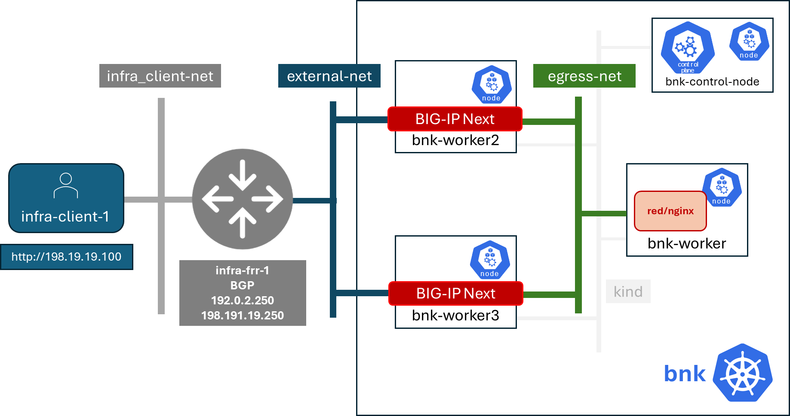

BIG-IP Next for Kubernetes is modular and can be deployed at various scales in . Our lab development environment with take advantage of Kind to build a Kubernetes cluster in a single virtual machine.

Our lab network diagram will look like this when we are done:




We will access the lab through web console user interfaces supplied per student. The link to your web console will be provided in the lab. 

![[USD Web Console UI.png]]

## Todo: Connect to your lab instance web console

Login to the web user interface, change to the ubuntu non-privileged user.

#### Run: `su -l ubuntu`

```
su -l ubuntu
```

#### Run: `docker network ls`

```
docker network ls
```

```
NETWORK ID     NAME      DRIVER    SCOPE
938d048cb58f   bridge    bridge    local
a7e18706eb7a   host      host      local
3ac8b0046fd9   none      null      local
```

We've done nothing but install docker. We see the default types of network docker will allow you to connect containers to, `bridge` (separate host network), `host` (directly connected to the host existing network interface), `null` (no networking). 

We won't use these networks, but rather build our own lab networks.

Our initial lab network diagram is BLANK! Nothing.. Zilch.. Nada..  We better fix that.

## Todo: Deploy a Kubernetes cluster

Explore what containers are deployed on you lab virtual machine:
#### Run: `docker ps`

```
docker ps
```

There should not be any. 
### Note:  What is Kind?
Kind stands for Kubernetes in Docker. It is a tool for running local Kubernetes clusters using Docker containers as "nodes". It is particularly useful for development, testing, and continuous integration environments.

To find out more about Kind and Kubernetes control plane tools we will use in the lab, like kubectl and helm, please visit:

![[Kind.png]]
[Find Out More about Kind](https://kind.sigs.k8s.io/)

![[Kubectl.png]]
[Find Out More about Kubernetes Command Line Tool](https://kubernetes.io/docs/reference/kubectl/)

![[Helm.png]]
[Find Out More about Helm - Kubernetes Package Manager](https://helm.sh/)

#### Run: `create-cluster.sh`

```
./create-cluster.sh
```

Here is what this script does:

1) It downloads the Kind node container images
2) Runs the 4 containers to and builds them into a Kubernetes cluster

Look at what containers are now running on your virtual machine:

#### Run: `docker ps`

```
docker ps
```

You should see 4 containers. 

At this point we access our Kubernetes API and ask it what nodes have been added to the cluster and their status:

#### Run: `kubectl get nodes`

```
kubectl get nodes
```

```
NAME                STATUS     ROLES           AGE     VERSION
bnk-control-plane   NotReady   control-plane   9m46s   v1.32.0
bnk-worker          NotReady   <none>          9m35s   v1.32.0
bnk-worker2         NotReady   <none>          9m35s   v1.32.0
bnk-worker3         NotReady   <none>          9m35s   v1.32.0
```

### Class Discuss: Kubernetes Networking Model

[Kubernetes networking](https://kubernetes.io/docs/concepts/cluster-administration/networking/) is designed to facilitate highly agile deployment of containers inside 'pods'. Each pod gets its own IP address and all pods in the same cluster can communicate with each other directly. 

Kubernetes defines 'services' to assign static IP which load balance to `Endpoints` which typically represent internal pod IP addresses and ports. Common 'service' types include:

[`ClusterIP`](https://kubernetes.io/docs/concepts/services-networking/service/#type-clusterip): service IP and port reachable throughout a cluster

[`NodePort`](https://kubernetes.io/docs/concepts/services-networking/service/#type-nodeport): service available from the data center on a Kubernetes node IP address and a port

[`LoadBalancer`](https://kubernetes.io/docs/concepts/services-networking/service/#loadbalancer): an external reachable service which provides L4 load balancing which directs traffic to internal cluster services

[`Ingress`](https://kubernetes.io/docs/concepts/services-networking/ingress/): an external reachable service which provide L7 HTTP based load balancing which directs traffic to internal cluster services

[`Gateway`](https://kubernetes.io/docs/concepts/services-networking/gateway/): NEW! CNCF service where NetOps infrastructure admins defined listeners and DevOps application admins defined routes. These can be L4 `TCPRoute`, `UDPRoute`, L6 `TLSRoute`, L7 `HTTPRoute` which handles HTTP/1.0 and HTTP/2.0 gRPC traffic. Gateway is extensible for custom routes support advanced application delivery needs.
## Todo: Deploy network plugins

So how do pods have their network interfaces created and IP addresses assigned? This is the role of a CNI (container network interface) plugins. We need to 'install a CNI' which will watch when Kubernetes schedules a pod and then create the new pod's network connection to the host and give it an IP address which works in the 'pod network' for the cluster.

![[CNI.png]]
[Find out more about CNI Plugins](https://www.cni.dev/)

Our nodes will not become ready for use because, so far, because they do not have a network provider CNI installed to meet their networking requirements. Let's deploy Calico CNI, a popular network plugin which provides network interfaces and IP addresses to containers as Kubernetes schedules them.

![[Calico.png]]
[Find out more about Calico CNI Plugin](https://docs.tigera.io/calico/latest/about)

By default, a pod will get only one network interface, `eth0`, and one pod network IP address. What do we do if we ant to add additional network interfaces to our pods for things like BIG-IP proxies to handle traffic?

We will also deploy an additional CNI plugin called Multus.  Multus controls the creation of additional network interfaces to Kubernetes pods and how they attachment to host networking. Multus abstracts what kind and the name of the host network to attach to through a `NetworkAttachementDefinition` resource declaration. 

![[Multus.png]]
[Find out more about Multus CNI Plugin](https://github.com/k8snetworkplumbingwg/multus-cni/blob/master/README.md)
#### Run: `deploy-cni.sh`

```
./deploy-cni.sh
```

```
Create CNI and Multus ...
poddisruptionbudget.policy/calico-kube-controllers created
serviceaccount/calico-kube-controllers created
serviceaccount/calico-node created
configmap/calico-config created
...
clusterrole.rbac.authorization.k8s.io/multus created
clusterrolebinding.rbac.authorization.k8s.io/multus created
serviceaccount/multus created
configmap/multus-cni-config created
daemonset.apps/kube-multus-ds created
configmap/cni-install-sh created
daemonset.apps/install-cni-plugins created

Waiting for Kubernetes control plane to get ready ...
```

Now we gotten this far, our Kubernetes nodes should be ready
#### Run: `kubectl get nodes`

```
kubectl get nodes
```

```
NAME                STATUS   ROLES           AGE   VERSION
bnk-control-plane   Ready    control-plane   54m   v1.32.0
bnk-worker          Ready    <none>          54m   v1.32.0
bnk-worker2         Ready    <none>          54m   v1.32.0
bnk-worker3         Ready    <none>          54m   v1.32.0
```

In addition you can see all the Kubernetes pods deployed. Notice you have one Calico controller for our cluster and a Calico node agent in each node ready to create network interfaces for pods and assign pod IP addresses.

You will also notice that Multus has a deployed on each one of a nodes. When a pod gets deployed on every node, this is called a `DaemonSet` deployment in Kubernetes.

#### Run: `kubectl get pods -A`

```
kubectl get pods -A
```

```
NAMESPACE   NAME                                   READY  STATUS   RESTARTS   AGE
kube-system calico-kube-controllers-8599ff4595-4z656 1/1  Running   0          108s
kube-system calico-node-dh7br                        1/1  Running   0          108s
kube-system calico-node-f2tvc                        1/1  Running   0          108s
kube-system calico-node-sqc7z                        1/1  Running   0          108s
kube-system calico-node-vdx8d                        1/1  Running   0          108s
kube-system coredns-668d6bf9bc-4xsb6                 1/1  Running   0          54m
kube-system coredns-668d6bf9bc-tj78s                 1/1  Running   0          54m
kube-system etcd-bnk-control-plane                   1/1  Running   0          54m
kube-system install-cni-plugins-b4zkx                1/1  Running   0          108s
kube-system install-cni-plugins-hxzdh                1/1  Running   0          108s
kube-system install-cni-plugins-jgwgm                1/1  Running   0          108s
kube-system install-cni-plugins-xsbn7                1/1  Running   0          108s
kube-system kube-apiserver-bnk-control-plane         1/1  Running   0          54m
kube-system kube-controller-manager-bnk-control-plane 1/1 Running   0          54m
kube-system kube-multus-ds-4bvff                     1/1  Running   0          108s
kube-system kube-multus-ds-hhvqm                     1/1  Running   0          108s
kube-system kube-multus-ds-hkxq7                     1/1  Running   0          108s
kube-system kube-multus-ds-qj82g                     1/1  Running   0          108s
kube-system kube-proxy-4tl67                         1/1  Running   0          54m
kube-system kube-proxy-7vtf9                         1/1  Running   0          54m
kube-system kube-proxy-8l7n4                         1/1  Running   0          54m
kube-system kube-proxy-zdpb8                         1/1  Running   0          54m
kube-system kube-scheduler-bnk-control-plane         1/1  Running   0          54m
local-path-storage   local-path-provisioner-58cc7856b6-ctsl2 1/1 Running 0     54m
```

Notice that KinD added its own network to connect the Kubernetes node containers which has its own bridge on the virtual machine host.

#### Run: `docker network ls`

```
docker network ls
```

```
NETWORK ID     NAME      DRIVER    SCOPE
938d048cb58f   bridge    bridge    local
a7e18706eb7a   host      host      local
01c75852c676   kind      bridge    local
3ac8b0046fd9   none      null      local
```

Here is where we are now:

![[KinD Deployed Lab Environment.png]]

## Todo: Create the lab networks in our virtual machine

So far docker has just one network used by our Kubernetes cluster, the network bridge, `kind` all our KinD Kubernetes nodes are attached to. In our network diagram we need to create the rest of the networks in our lab: `infra_client-net`, `external-net` and `egress-net`.

#### Run: `create-lab-networks.sh`

```
./create-lab-networks.sh
```

```
Creating docker networks external-net and egress-net and attach both to worker nodes ...
9fbe21d0d55bddd34a04dc41aa5261961e4780046729c515609b0d7d5fb4c28e
65fd7b73f6042d14a4e900c94f45df836c9ecff311fe88685f6c5e5c3d6dffd3
node/bnk-worker annotated
node/bnk-worker2 annotated
node/bnk-worker3 annotated
Flush IP on eth1 in each worker node, the node won't use it, only TMM will
```

We've created lab networks for the client (`infra_client-net`) and MACVLAN networks `external-net` for BIG-IP to host ingress virtual servers, and `egress-net` for BIG-IP to capture outbound packets from pods and route them to the correct network with appropriate SNAT (source network address translation) pools.

Each of these network gets attached to all of our KinD Kubernetes nodes. This is our analog to adding network interfaces to physical servers. 

#### Run: `docker network ls`

```
docker network ls
```

```
NETWORK ID     NAME               DRIVER    SCOPE
a749e9e46e78   bridge             bridge    local
65fd7b73f604   egress-net         macvlan   local
9fbe21d0d55b   external-net       macvlan   local
a7e18706eb7a   host               host      local
4f6963ba7d7d   infra_client-net   bridge    local
c23770001ba1   kind               bridge    local
3ac8b0046fd9   none               null      local
```

Our lab network now looks like this

![[All Docker Networks in Lab Environment.png]]


We'll use Multus `NetworkAttachmentDefinition` to connect our BIG-IP pods to the `external` and `internal` networks in the diagram above. We define `NetworkAttachmentDefinition` so when pods are created on nodes which are supposed to have Multus attach additional network interfaces, the Multus process on each node knows what type of network and what network name to give it inside our pod. Think of `NetworkAttachmentDefinition` as our policy to figure out how to create these interfaces in our pods.
### Show: `resources/networks.yaml` Network Attachments

```
apiVersion: "k8s.cni.cncf.io/v1"
kind: NetworkAttachmentDefinition
metadata:
  name: external-net
spec:
  config: '{
      "cniVersion": "0.3.1",
      "type": "macvlan",
      "master": "eth1",
      "mode": "bridge",
      "ipam": {}
    }'
```

```
apiVersion: k8s.cni.cncf.io/v1
kind: NetworkAttachmentDefinition
metadata:
  name: egress-net
spec:
  config: '{
      "cniVersion": "0.3.1",
      "type": "macvlan",
      "master": "eth2",
      "mode": "bridge",
      "ipam": {}
    }'
```

#### Run: `create-bigip-network-attachments.sh`

```
./create-bigip-network-attachements.sh
```

```
Create Multus Network Attachments ...
networkattachmentdefinition.k8s.cni.cncf.io/external-net created
networkattachmentdefinition.k8s.cni.cncf.io/egress-net created

NAME           AGE
egress-net     0s
external-net   0s
```

We can now create pods and declare that we want them connected to `egress-net` and `external-net` and Calico will create `eth0` on the standard pod network, Multus will create `eth1` for `external-net` and `eth2` for `egress-net`.
### Class Discuss: BIG-IP Next for Kubernetes Network Options
BIG-IP Next for Kubernetes can be connected in multiple ways. 

1) Full host offload in DPUs
   
   DPUs present standalone SoC (system on a chip) processors with their own network connectivity options. Currently, BIG-IP Next for Kubernetes is supported on 
   NVIDIA BlueField-3 DPUs where connectivity is established using NVIDIA DOCA network acceleration APIs. F5's NVIDIA BlueField-3 integration directly connects BIG-IP to the hardware eSwtich on the DPU through the use of DOCA 'scalable functions'. This enables the BIG-IP on each DPU to process traffic for all connected workloads running on the host with the DPU installed.
   ![[BIG-IP on DPU.png]]
   
   A full installation guide for the host node and the NVIDIA BlueField-3 DPU for use with BIG-IP Next for Kubernetes has been create [here](https://f5devcentral.github.io/f5-bnk-nvidia-bf3-installations/).
   
2) Running on a host system with DPDK
   
   DPDK (data plane development kit) was developed as a standard for accelerated network access for user processes (called execution units) which pre-allocates network devices, compute cores and memory for network processing. Network data access is done through data polling of dedicated queues associated with the assigned network interfaces. The host kernel is offloaded from interrupt handlers associated with the DPDK dedicated network interfaces. Depending on the user process used for networking, this can greatly improves network processing rates and lower network latency. BIG-IP Next data plane is a full proxy stack from the DPDK network interface driver through full application protocols like HTTP. 
   
   ![[BIG-IP on DPDK.png]]
   
3) Connecting through a host linux kernel networking
   
   Linux networking has various virtual network devices and socket API layers. BIG-IP Next can use 'raw sockets' to provide data queues, which is the lowest place in the kernel networking stack which will still fully share a network interface with the host. Both the performance and latency suffer when compared to dedicating network interfaces and compute resources. 
   
   Alternatively, in test environments, BIG-IP Next can be provided virtual networking interfaces in much the same was as they are provided to virtual machines. Our lab will take advantage of a software virtual network interface of type MACVLAN. You can see this in our Multus `NetworkAttachmentDefinition`.
   
   ![[BIG-IP on Linux Netdev.png]]

## Todo: Create a router and a client container in our virtual machine

All we need to do is build a router and connect it to the right networks and build a client connecting it to the right networks. 

We will deploy the open source Free Range Routing (FRR), `infra-frr-1`, a collection of open source daemons which create a router.  There is a community containerized version. We will attach it to the `external-net` and `infra_client-net` docker networks.

![[FRRouter.png]]
[Find out more about FRRouting](https://docs.frrouting.org/)

We will deploy a simple nginx demo container, `infra-client-1`, which will function as both our client and a simple way to observe egress traffic. 

We will orchestrate the creation of these containers with `docker-compose`.
#### Run: `create-router-and-client-containers.sh`

```
./create-router-and-client-containers.sh
```

```
Deploy FRR and client docker container ...
[+] Running 4/4
 ✔ Network infra_client-net  Created  0.2s
 ✔ Container infra-frr-1     Started  0.5s
 ✔ Container infra-client-1  Started  0.5s
 ✔ Container syslog-server   Started  0.5s
```

Now our lab environment looks like this.

![[Infrastructure Router and Client in Lab Environment.png]]

Our lab environment is complete. It mirrors all the standard components of a Kubernetes environment. It is now time to deploy BIG-IP Next for Kubernetes.
