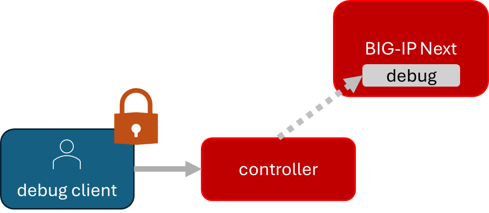
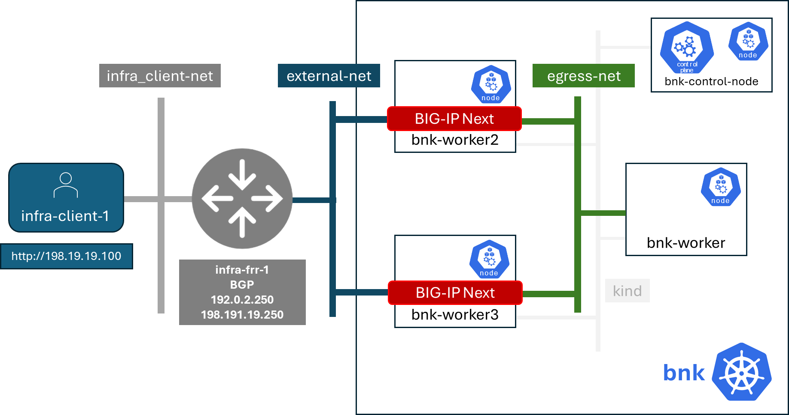
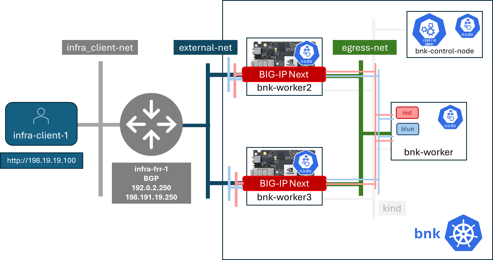

#### Important - We are taking you through a painful path to instruct. 
BIG-IP Next for Kubernetes in GA (general availability) is organizing the installation into the OLM (operator lifecycle manager) compliant operator you will see in these steps. 
##### STAY CALM and Lab On!


[Learn more about OLM Operators](https://olm.operatorframework.io/)

There are a couple of prerequisites for our lab we are going to install. 
## Todo: Installing community services and resources

First, for zero-trust communication between services, we will need a way to issue certificates.  There is a common open source component which is included in many Kubernetes distributions, but we will install it here. It is cert-manager.


[Learn more about cert-manager](https://cert-manager.io/)
#### Run: `create-cert-manager.sh`

```
./create-cert-manager.sh
```

```
Install cert-manager and clustr issuer to manage pod-to-pod certs ...
"jetstack" has been added to your repositories
Release "cert-manager" does not exist. Installing it now.
NAME: cert-manager
LAST DEPLOYED: Thu Feb 20 07:28:10 2025
NAMESPACE: cert-manager
STATUS: deployed
REVISION: 1
TEST SUITE: None
NOTES:
cert-manager v1.16.1 has been deployed successfully!

In order to begin issuing certificates, you will need to set up a ClusterIssuer
or Issuer resource (for example, by creating a 'letsencrypt-staging' issuer).

More information on the different types of issuers and how to configure them
can be found in our documentation:

https://cert-manager.io/docs/configuration/

For information on how to configure cert-manager to automatically provision
Certificates for Ingress resources, take a look at the `ingress-shim`
documentation:

https://cert-manager.io/docs/usage/ingress/
pod/cert-manager-74b7f6cbbc-fblj8 condition met
pod/cert-manager-cainjector-58c9d76cb8-4qcdk condition met
pod/cert-manager-webhook-5875b545cf-bp5cn condition met
clusterissuer.cert-manager.io/selfsigned-cluster-issuer created
certificate.cert-manager.io/bnk-ca created
clusterissuer.cert-manager.io/bnk-ca-cluster-issuer created
```

BIG-IP Next for Kubernetes used the CNCF Gateway APIs. We need to install the resource definitions for the Gateway API. 

[Learn more about Gateway API](https://gateway-api.sigs.k8s.io/)

We will also install Prometheus and Grafana so we can collect metrics and look at some telemetry dashboards in the next lab. 


[Learn more about Prometheus](https://prometheus.io/)


[Learn more about Grafana](https://github.com/grafana/grafana/blob/main/README.md)

We will create a certificate for the BIG-IP Next OTEL service so it can communicate securely.


[Learn more about OTEL](https://opentelemetry.io/)
#### Run: `deploy-gatewayapi-telemetry.sh`

```
./deploy-gatewayapi-telemetry.sh
```

```
Install Gateway API CRDs ...
customresourcedefinition.apiextensions.k8s.io/backendlbpolicies.gateway.networking.k8s.io created
customresourcedefinition.apiextensions.k8s.io/backendtlspolicies.gateway.networking.k8s.io created
customresourcedefinition.apiextensions.k8s.io/gatewayclasses.gateway.networking.k8s.io created
customresourcedefinition.apiextensions.k8s.io/gateways.gateway.networking.k8s.io created
customresourcedefinition.apiextensions.k8s.io/grpcroutes.gateway.networking.k8s.io created
customresourcedefinition.apiextensions.k8s.io/httproutes.gateway.networking.k8s.io created
customresourcedefinition.apiextensions.k8s.io/referencegrants.gateway.networking.k8s.io created
customresourcedefinition.apiextensions.k8s.io/tcproutes.gateway.networking.k8s.io created
customresourcedefinition.apiextensions.k8s.io/tlsroutes.gateway.networking.k8s.io created
customresourcedefinition.apiextensions.k8s.io/udproutes.gateway.networking.k8s.io created

Install Promethues and Grafana ...
certificate.cert-manager.io/prometheus created
deployment.apps/prometheus created
configmap/prometheus-config created
service/prometheus-service created
clusterrole.rbac.authorization.k8s.io/prometheus-default created
clusterrolebinding.rbac.authorization.k8s.io/prometheus-default created
deployment.apps/grafana created
configmap/grafana-datasources created
service/grafana created

Install OTEL prerequired cert ...
certificate.cert-manager.io/external-otelsvr created
certificate.cert-manager.io/external-f5ingotelsvr created
```

## Todo: Adding a cluster tenant for F5 utilities

We are going to put all of the shared utility components for BIG-IP Next for Kubernetes into a proper namespace. This allows us to properly protect access to these resources in a the cluster.
#### Run: `create-f5util-namespace.sh`

```
./create-f5util-namespace.sh
```

```
Create f5-utils namespace for BNK supporting software
namespace/f5-utils created
```

## Todo: Enable access to FAR

It's time to download the BIG-IP Next for Kubernetes product.

Cloud native apps are downloaded from various software registries. The most familiar one was introduced when docker introduced container orchestration to world, [dockerhub](https://hub.docker.com). Kubernetes distribution vendors maintain registries, like [Red Hat Quay](https://quay.io/). The hyperscale cloud providers maintain their registries. 

Private corporate or product registries use mTLS based authentication and authorization to control access to software resources. 

F5 runs a artifact (containers images, orchestration files, manifest files for component versioning, utilities files) named creatively FAR (F5 artifact registry). In order to authenticate to FAR, we need certificate based credentials.
## Note: How do you get FAR credentials

We have written up how to get FAR credential for all BIG-IP Next products. The process is simple, but requires a login to https://my.f5.com. 

[Read How to Download FAR credentials](https://clouddocs.f5.com/bigip-next-for-kubernetes/2.0.0-LA/far.html#download-the-service-account-key)

Because we can't be sure that everyone has access to my.f5.com already, we have copied the FAR authentication credentials to the lab virtual machine already. 

```
ls far/f5-far-auth-key.tgz
```

```
far/f5-far-auth-key.tgz
```

We will add the credentials as a Kubernetes secret and then add FAR as a repository for Helm, the Kubernetes native package manager. 

[Learn more about Helm](https://helm.sh/)
#### Run: `add-far-registry.sh`

```
./add-far-registry.sh
```

```
F5 Artifacts Registry (FAR) authentication token ...
Create the secret.yaml file with the provided content ...
secret/far-secret created
secret/far-secret created
Login Succeeded
```

## Todo: Enable BIG-IP Next debug service access

We need to create a way for clients outside the cluster to create secured communications for debug services inside the cluster. This external access will allow you do get product information, do licensing reporting, collect qkviews for support, and have access to debug traffic.

These credentials will be stored in Kubernetes secrets, but we will also copy the credentials to files in the virtual machine host so we can use them for a demonstration an debug API access. We will do this in lab three.



We need to create these credentials before we install everything for BIG-IP Next.
#### Run: `install-cwc.sh`

```
./install-cwc.sh
```

```
Install Cluster Wide Controller (CWC) to manage license and debug API ...
Pulled: repo.f5.com/utils/f5-cert-gen:0.9.1
Digest: sha256:89d283a7b2fef651a29baf1172c590d45fbd1e522fa90207ecd73d440708ad34
~/cwc ~
------------------------------------------------------------------
Service                   = api-server
Subject Alternate Name    = f5-spk-cwc.f5-utils
Working directory         = /home/ubuntu/cwc/api-server-secrets
------------------------------------------------------------------
...
Creating 1 client extensions...
...
Copying secrets ...
Generating /home/ubuntu/cwc/cwc-license-certs.yaml
Generating /home/ubuntu/cwc/cwc-license-client-certs.yaml
~
secret/cwc-license-certs created
Create directory for API client certs for easier reference ...
~/cwc ~
~

Install cwc-reqs ...
configmap/cpcl-key-cm created
configmap/cwc-qkview-cm created
```

That's the last prerequisite environment resource we needed. Let's install BIG-IP!
## Todo: Install a BIG-IP Next for Kubernetes deployment

We will use Helm to install our OLM compliant operator which will then orchestrate dynamically the lifecycle of the BIG-IP Next for Kubernetes components. That's why operators are cool. They are orchestrators which run constantly in your Kubernetes clusters doing their job for you.
#### Run: `install-bnk.sh`

```
./install-bnk.sh
```

```
Install BNK ...
configmap/bnk-bgp created
node/bnk-worker2 labeled
node/bnk-worker3 labeled
...

Install orchestrator ...
Release "orchestrator" does not exist. Installing it now.
NAME: orchestrator
LAST DEPLOYED: Thu Feb 20 14:31:25 2025
NAMESPACE: default
STATUS: deployed
REVISION: 1
TEST SUITE: None
..../create
```

The orchestrator stays running and watches for addition or changes to resources it needs to then orchestrate on BIG-IP.
#### Run: `kubectl get pod | grep orchestrator`

```
kubectl get pod | grep orchestrator
```

```
orchestrator-f5cbc78cf-kfgxx        1/1     Running   0          1m
```

Wow.. label nodes for BIG-IP Next installation.. install the orchestration.. BOOM.. Install. 


### Class Discuss: BIG-IP Next for Kubernetes on NVIDIA DPU nodes
In the above installation we labeled two nodes and pretty much dedicated these nodes to BIG-IP Next. We don't need to do this, but this illustrates how a NVIDIA DPUs would look. 


When you enable the NVIDIA BlueField-3 in DPU mode, it shows up as a separate node in your cluster. We label those nodes the same way we did in our install and the operator does the install as it would.


## Todo: Create Kubernetes tenant networks for ingress and egress

#### Run: `create-tenants.sh`

```
./create-tenants.sh
```

```
Create red tenant namespace...
Error from server (AlreadyExists): namespaces "red" already exists

Create blue tenant namespace...
Error from server (AlreadyExists): namespaces "blue" already exists

Creating VLANs for tenant ingress
f5spkvlan.k8s.f5net.com/external created
f5spkvlan.k8s.f5net.com/egress created
f5spkvlan.k8s.f5net.com/egress condition met
f5spkvlan.k8s.f5net.com/external condition met

Install vxlan for tenant egress
f5spkvxlan.k8s.f5net.com/red created
f5spkvxlan.k8s.f5net.com/blue created
f5spkvxlan.k8s.f5net.com/blue condition met
f5spkvxlan.k8s.f5net.com/red condition met

Install SNAT Pools to be selected on egress for tenant namespaces
f5spksnatpool.k8s.f5net.com/red-snat created
f5spksnatpool.k8s.f5net.com/blue-snat created
f5spkegress.k8s.f5net.com/red-egress created
f5spkegress.k8s.f5net.com/blue-egress created

Little lab hack to disable TX offload capabilities on egress vxlans

bnk-worker2

bnk-worker
Actual changes:
tx-checksum-ip-generic: off
tx-tcp-segmentation: off [not requested]
tx-tcp-ecn-segmentation: off [not requested]
tx-tcp-mangleid-segmentation: off [not requested]
tx-tcp6-segmentation: off [not requested]
Actual changes:
tx-checksum-ip-generic: off
tx-tcp-segmentation: off [not requested]
tx-tcp-ecn-segmentation: off [not requested]
tx-tcp-mangleid-segmentation: off [not requested]
tx-tcp6-segmentation: off [not requested]

bnk-worker3

Install a global logging profile for all tenants
f5bigcontextglobal.k8s.f5net.com/global-context configured
f5bigloghslpub.k8s.f5net.com/logpublisher created
f5biglogprofile.k8s.f5net.com/logprofile created
```

We just created ingress and egress network for blue and red tenants.



We successfully install BIG-IP Next for Kubernetes and setup two infrastructure tenant networks. 

In lab 3 we will get some hands on use of BIG-IP Next for Kubernetes.

